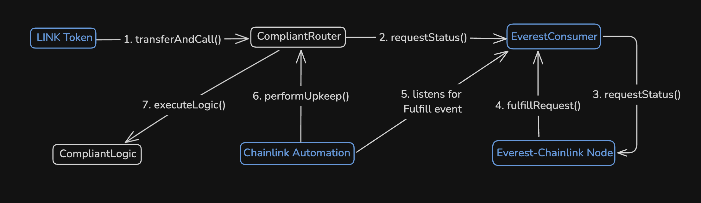

# Contract Level Compliance

This project provides a framework for implementing compliance in smart contracts. The two key contracts in this system are `CompliantRouter` and `CompliantLogic`. The `CompliantRouter` contract can be interacted with to request the KYC status of an address and automatically route the result to a client-defined implementation of the `CompliantLogic` contract.

## Table of Contents

- [Contract Level Compliance](#contract-level-compliance)
  - [Table of Contents](#table-of-contents)
  - [Overview](#overview)
  - [How does the compliance work?](#how-does-the-compliance-work)
  - [User Flow](#user-flow)
  - [Compliant Restricted Functionality](#compliant-restricted-functionality)
  - [Fees](#fees)
    - [Compliant Fee](#compliant-fee)
    - [Everest Fee](#everest-fee)
    - [Automation Fee](#automation-fee)
  - [Testing](#testing)
  - [Formal Verification](#formal-verification)
  - [Deployment](#deployment)
    - [CompliantRouter](#compliantrouter)
    - [CompliantLogic](#compliantlogic)
  - [Additional Comments](#additional-comments)
  - [Disclaimer](#disclaimer)
  - [Archives](#archives)

## Overview

Contract Level Compliance removes the risk of non-compliance at the lowest level of agreement execution, enabling regulated activity to be available on public chains.

## How does the compliance work?

Requests for the KYC status of an address are made through the [Chainlink](https://docs.chain.link/) network to [Everest](https://developer.everest.org/#chainlink-access-to-everest-oracle), a regulated provider of private and sybil resistant user data.

The request is for whether the address being queried has been sybil resistantly linked to someone who has completed KYC with the regulated entity or not.

Compliant restricted logic can only be executed on behalf of users who meet this criteria.

## User Flow

Users can interact with the `CompliantRouter` contract to request the KYC status of an address in two ways:

1. Call `LINK.transferAndCall()` on the LINK token contract, passing the Compliant contract's address, fee amount, and calldata. The calldata should include the address to query, and the client-defined `CompliantLogic` address to callback.



2. Call `LINK.approve()` on the LINK token address, passing the Compliant contract's address and fee amount. Then call `Compliant.requestKycStatus()`, passing the address to query and the client-defined `CompliantLogic` address to callback.

The fee amount to pass for both options can be read from `CompliantRouter.getFee()`.

## Compliant Restricted Functionality

Once a request for the KYC status of an address has been fulfilled by the Everest Chainlink node, Chainlink Log Trigger Automation will be used to route the response to the user/client's `CompliantLogic` implementation. 

`CompliantLogic` is an abstract contract. Users must inherit and override the internal `_compliantLogic()` function. If the `CompliantLogic` contract address passed to the `CompliantRouter` during requests does not implement the expected interface, the request will revert.

## Fees

A fee in LINK is taken for each request, covering the following:

- `CompliantRouter` contract fee
- Everest fee
- Chainlink Automation fee

### Compliant Fee

This fee is intended as payment for the Owner of the `CompliantRouter` contract. Chainlink Price Feed is used to get the USD value of LINK and calculate how much the `CompliantRouter` contract should receive. Currently it is set to 50c per request, but a lower value or even a configurable value would be more attractive. These accumulated `CompliantRouter` fees could then be periodically distributed amongst holders of a potential `Contract Level (LEVEL)` token using Chainlink Automation.

### Everest Fee

This fee is required to pay for requests made to Everest's Chainlink node.

### Automation Fee

This fee is whatever the minimum balance required to maintain the associated Chainlink Automation Upkeep is.

## Testing

Run `forge install` to install dependencies.

See coverage with `forge coverage` and `forge coverage --report debug`.

The `cannotExecute` modifier on `checkLog()` will have to be commented out for some of the tests in `CheckLog.t.sol` to pass. This will also require the `test_compliant_checkLog_revertsWhen_called` test to be commented out too. The reason for this is that `checkLog()` is only intended to be simulated offchain by Chainlink Automation nodes, and not actually called onchain.

For unit tests run:

```
forge test --mt test_compliant
```

For invariant tests run:

```
forge test --mt invariant
```

## Formal Verification

This project uses [Certora](https://docs.certora.com/en/latest/) for formal verification.

To run the specification, first export your Certora prover key, and then run the configuration file:

```
export CERTORAKEY=<YOUR_KEY_HERE>
certoraRun ./certora/conf/Compliant.conf
```

## Deployment

### CompliantRouter
*Deployed by contractlevel.com team*

This contract uses a `TransparentUpgradeableProxy` (`CompliantProxy`) to store Chainlink Automation `forwarder` and `upkeepId` as immutable, saving gas for the end user. These are the deployment steps to ensure this functionality and immutability of the `Compliant` contract:

- deploy `InitialImplementation`, an essentially blank contract that implements the `ILogAutomation` interface to make it compatible with registering for Chainlink Automation
- deploy `CompliantProxy`, pointing at the `InitialImplementation`
- register `CompliantProxy` with Chainlink Automation
- deploy `CompliantRouter` with immutable `forwarder` and `upkeepId`
- upgrade `CompliantProxy` to point at `CompliantRouter`
- renounceOwnership of CompliantProxy's `ProxyAdmin` Admin, ensuring the implementation cannot be changed again

### CompliantLogic
*Deployed by user*

Pass the `CompliantRouter` (`CompliantProxy`) address in the constructor.

## Additional Comments

This project uses a [community fork of the EverestConsumer](https://github.com/palmcivet7/everest-chainlink-consumer) with updated Chainlink function names, gas optimizations and a label adjustment in the `IEverestConsumer` interface.

It is currently only possible to pay for `CompliantRouter` requests with the LINK token. A future feature could be payment abstraction allowing the use of payments in other tokens such as native, USDC, etc that then get swapped to LINK.

## Disclaimer

This software is provided "as is," without any express or implied warranties, including but not limited to warranties of merchantability, fitness for a particular purpose, or non-infringement. Use of this software is at your own risk. The authors and contributors are not responsible for any security vulnerabilities, legal issues, or damages arising from its use. It is the user's responsibility to ensure compliance with applicable laws and regulations.

## Archives

Each significant iteration of this project has been archived in its own branch.

- **2024-11-30** - Initial implementation with 100% unit coverage
- **2024-12-23** - Foundry invariant tests and Certora
- **2024-12-31** - Calldata compression with Solady.LibZip
- **2025-01-23** - Framework separated into Router and Logic